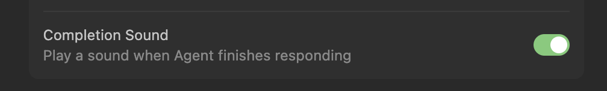

# Cursor Chimes

Custom chime sounds for [Cursor](https://cursor.sh). Replace the default "task done" chime with something better.

Cursor plays a short sound when LLM output finishes (if enabled). This repo provides alternative sounds and a couple of ways to install them. Ensure you have "Completion Sound" enabled in Cursor Settings before proceeding.

**Note: This works on MacOS only. Instructions for Windows uses may come later.** 

## Prerequisites

Enable the chime in Cursor: **Settings → search "completion" → enable "Completion Sound: Play a sound when agent finishes responding"**.



## Option 1: Single Sound Replacement

The simplest approach. Pick one MP3 and copy it over the default:

```bash
# Back up the original
cp /Applications/Cursor.app/Contents/Resources/app/out/vs/platform/accessibilitySignal/browser/media/done1.mp3 \
   ~/done1-original.mp3

# Replace with your chosen sound
cp sounds/zelda_puzzle.mp3 \
   /Applications/Cursor.app/Contents/Resources/app/out/vs/platform/accessibilitySignal/browser/media/done1.mp3
```

Restart Cursor. That's it.

**Downside:** Cursor updates will overwrite your custom sound. Re-run the `cp` after each update.

## Option 2: Random Sound Rotation

Patch Cursor's JavaScript to randomly select from multiple sounds each time the chime plays. This gives you a different sound on every LLM completion.

### Install Script

```bash
git clone https://github.com/jcraigk/cursor-chimes.git
cd cursor-chimes
./scripts/install-cursor-chimes.sh
```

The script:
1. Copies all MP3s from `sounds/` into Cursor's media directory (renamed to `custom-chime1.mp3`, `custom-chime2.mp3`, etc.)
2. Patches the JS to randomly pick one on each chime
3. Detects if the patch is already applied (safe to re-run)

You can also point it at a custom folder of MP3s:

```bash
./scripts/install-cursor-chimes.sh ~/my-sounds
```

Restart Cursor after running. Re-run after each Cursor update.

**Note:** The script uses hardcoded `sed` patterns to patch Cursor's minified JS. If a Cursor update changes variable names in the JS (e.g., `RB` becomes `XB`), the script will fail safely and restore the backup. If that happens, use the AI-assisted fallback below.

### Fallback: AI-Assisted Patch

If the install script fails after a Cursor update, you can ask Cursor's AI agent to apply the same patch. The AI can read the updated JS and adapt to any renamed variables. Paste this prompt into Cursor chat:

> **Prompt:**
>
> I want to customize the chime sound that plays when LLM output finishes. The chime code is in `/Applications/Cursor.app/Contents/Resources/app/out/vs/workbench/workbench.desktop.main.js`. It calls `playSound` with a `done1` sound reference for the chime.
>
> I have custom MP3 files in this repo's `sounds/` folder.
>
> Please:
> 1. Copy my MP3s into Cursor's media directory at `/Applications/Cursor.app/Contents/Resources/app/out/vs/platform/accessibilitySignal/browser/media/` with names like `custom-chime1.mp3`, `custom-chime2.mp3`, etc.
> 2. In the JS file, find where `done1` is registered as a sound and add registrations for each custom-chime file.
> 3. Find the `playSound` calls that reference `done1` in the chime code and replace them with a random selection from the custom-chime sounds.
> 4. Back up the JS file before patching.

## Included Sounds

| File | Description | Duration |
|------|-------------|----------|
| `zelda_botw.mp3` | Breath of the Wild chime | ~2.8s |
| `zelda_orb.mp3` | Zelda orb collected | ~3.0s |
| `zelda_puzzle.mp3` | Zelda puzzle solved | ~2.3s |
| `zelda_treasure.mp3` | Zelda treasure chest opened | ~3.0s |

## Adding Your Own Sounds

Drop any MP3 into the `sounds/` folder. Keep them under 3 seconds — Cursor will cut off longer sounds. Then re-run the install script.

## Notes

- After patching, Cursor will show a "Your Cursor installation appears to be corrupt" warning on startup. This is safe to dismiss — it's just a checksum mismatch from the modified JS.
- All changes are confined to the Cursor app bundle and will be reverted on the next Cursor update.
- The patch does not affect any Cursor functionality beyond the chime sound.

## License

MIT
